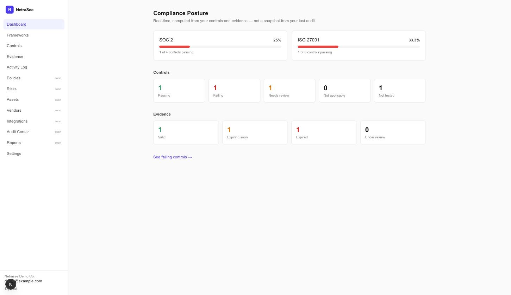
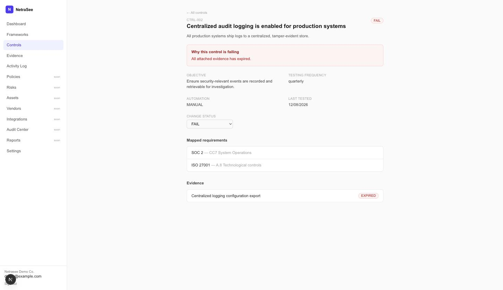
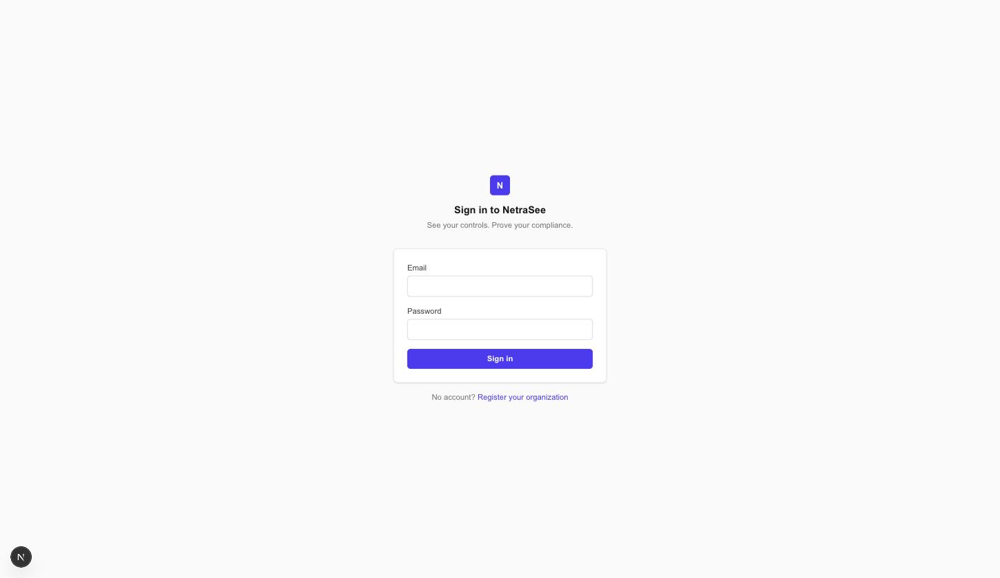

# NetraSee

**Open-source, evidence-backed compliance for teams who don't want a checklist app.**

Most compliance tools show you a checklist someone filled in once. NetraSee computes
your compliance posture live, from your actual controls and evidence — if evidence
expires or a control fails, the dashboard reflects that the moment it happens, not
whenever someone remembers to update a spreadsheet.



## The core idea

Every framework (SOC 2, ISO 27001, ...) is just a set of requirements. Every
requirement is satisfied by one or more **controls**. Every control is proven by
**evidence**, which expires. Change any of those, and every number on the dashboard —
framework progress, pass/fail counts, evidence freshness — is recalculated from the
current state, not read from a cached snapshot.

Click through and NetraSee tells you *why* something is failing, not just that it is:



That drill-down (Dashboard → Framework → Control → "why" → evidence → fix) is the
one flow this v1 was built to get right end to end.

## What's actually built (v1)

| Area | Status |
|---|---|
| Auth (session cookies, argon2id, CSRF) | ✅ |
| Multi-tenant orgs, 3 roles (Owner/Admin/Viewer) | ✅ |
| Frameworks + requirements, progress computed live | ✅ (SOC 2, ISO 27001 seeded) |
| Controls (many-to-many to requirements, real reuse) | ✅ |
| Evidence (upload, expiry-aware status, control links) | ✅ |
| Append-only audit log | ✅ |
| Policies / Risks / Assets / Vendors / Integrations / Audit Center / Reports | 🚧 Not built — see [Roadmap](#roadmap) |

Nothing above is a mockup. It's backed by a real Postgres database, 33 passing
integration tests (including 6 dedicated cross-tenant-isolation tests), and every
number on every screenshot in this README came from actually running the app.

## Quick start

### Docker Compose

```bash
git clone https://github.com/ImGauravbhosale/NetraSee.git
cd NetraSee
docker compose up
```

> **Note:** the Docker path is structurally complete but hasn't been run
> end-to-end yet (no Docker daemon available in the environment this was built
> in). The **local dev** path below has been fully verified — servers started,
> demo data seeded, and the actual UI walked through in a browser. If you hit
> anything with `docker compose up`, please open an issue.

This brings up Postgres, the backend (migrations run automatically), and the
frontend. Once it's up:

```bash
docker compose exec backend uv run python scripts/seed_demo.py
```

Then open **http://localhost:3000/login**.

### Local dev (no Docker)

```bash
# Postgres — any local instance works; create two DBs: netrasee, netrasee_test

# Backend
cd backend
uv sync
uv run alembic upgrade head
uv run python scripts/seed_demo.py
uv run uvicorn app.main:app --port 8000

# Frontend (separate terminal)
cd frontend
npm install
npm run dev
```

Open **http://localhost:3000/login**.

### Demo login

```
email:    demo@example.com
password: netrasee-demo-1234
```

Change this immediately if you deploy anywhere other than your own machine — it's a
seeded demo account, nothing more.



## Documentation

- **[User Guide](docs/USER_GUIDE.md)** — walkthrough of the app: registering an org,
  adopting a framework, linking evidence to controls, understanding statuses and
  roles.
- **[Roadmap](#roadmap)** below — what's deferred and why.

## Architecture

```
NetraSee/
├── docker-compose.yml
├── backend/            FastAPI + SQLAlchemy 2.0 (async) + PostgreSQL + Alembic
│   └── app/
│       ├── api/        route handlers
│       ├── core/       config, db session, security (argon2, CSRF, session tokens)
│       ├── models/     SQLAlchemy ORM
│       ├── schemas/    Pydantic request/response
│       └── services/   audit log, evidence status, login rate limiting
└── frontend/           Next.js 16 (App Router) + TypeScript + Tailwind
    ├── app/            one route per page
    ├── components/     NavShell, StatusBadge, ProgressBar
    └── lib/            typed API client, auth context
```

**Stack:** Python/FastAPI, SQLAlchemy 2.0 (async, asyncpg), Alembic, PostgreSQL,
Pydantic v2 on the backend; Next.js 16, TypeScript, Tailwind v4 on the frontend.

## Security model

- **Auth**: HttpOnly session cookie backed by a server-side `sessions` table
  (hashed token, real logout/revocation — not a bare stateless JWT), argon2id
  password hashing, double-submit CSRF cookie on every mutating request.
- **Tenant isolation**: every `/orgs/{org_id}/...` endpoint resolves the caller's
  membership in that exact org before doing anything else, and returns `404` (not
  `403`) for non-members — a non-member can't tell the org exists at all. This is
  the single most-tested piece of logic in the codebase (6 dedicated tests, each
  confirming a user from Org B is rejected on every Org A resource).
- **Privilege escalation guard**: an Admin cannot grant Owner — only an existing
  Owner can grant Owner.
- **Evidence upload**: extension allow-list, size cap, SHA-256 checksum, and a
  server-generated filename (never the client-supplied one) to avoid path
  traversal.
- **Audit log**: every mutating action writes an append-only `audit_events` row —
  actor, before/after state, timestamp.

Deferred and documented, not silently skipped: SSO/OAuth, MFA, secrets
encryption-at-rest (no integrations exist yet to need it).

## Roadmap

Explicitly out of scope for v1, listed here rather than silently dropped:

- Connectors (GitHub / AWS / Google Workspace / Jira) for automated evidence
  collection
- Compliance-as-code (YAML-defined controls)
- Policies, Risk register, Asset inventory, Vendor management
- Audit Center (auditor-facing workspace)
- Notifications, report exports
- Additional frameworks beyond SOC 2 / ISO 27001
- 4 more RBAC roles beyond Owner/Admin/Viewer

## Running the tests

```bash
cd backend
uv run pytest
```

33 tests, run against a real Postgres database (not mocked) — auth, tenant
isolation, role/permission checks, CSRF, evidence status computation, and SQL
injection safety on filter parameters.

## License

MIT
