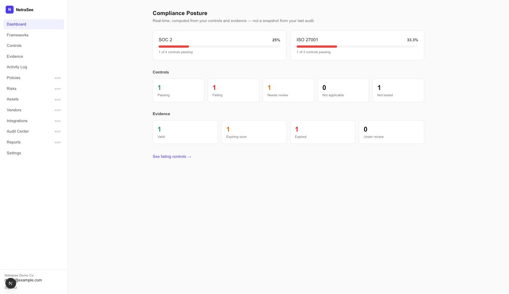
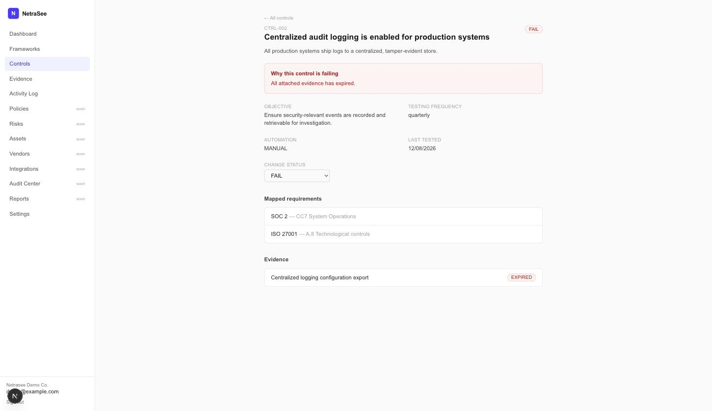
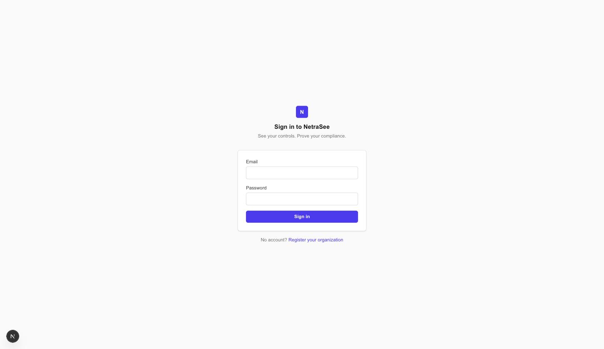

# NetraSee

[](https://github.com/ImGauravbhosale/NetraSee/actions/workflows/test.yml)
[](LICENSE)
[](backend/pyproject.toml)
[](frontend/package.json)

Open-source, evidence-backed compliance for teams who don't want a checklist app.
Most compliance tools show you a checklist someone filled in once — NetraSee
computes your posture live from real controls and evidence, and can check a
control itself against a live GitHub or AWS account instead of waiting on a
human to upload a screenshot.

## Try it in 30 seconds — no database, no server

```bash
git clone https://github.com/ImGauravbhosale/NetraSee.git
cd NetraSee/backend && uv sync
uv run netrasee-check --list-checks
uv run netrasee-check --provider github --check github.branch_protection \
  --target torvalds/linux --token "$GITHUB_TOKEN" --json
```

That's the same check engine that runs behind the full web dashboard below —
real API call, real PASS/FAIL/NEEDS_REVIEW, exit code built for a CI gate. See
[CLI and CI gate](#not-just-a-web-app--a-cli-and-a-ci-gate) for the GitHub
Action version.



## The core idea

Every framework (SOC 2, ISO 27001, ...) is just a set of requirements. Every
requirement is satisfied by one or more **controls**. Every control is proven by
**evidence**, which expires. Change any of those, and every number on the dashboard —
framework progress, pass/fail counts, evidence freshness — is recalculated from the
current state, not read from a cached snapshot.

Click through and NetraSee tells you *why* something is failing, not just that it is:



That drill-down (Dashboard → Framework → Control → "why" → evidence → fix) is the
one flow this v1 was built to get right end to end.

## Automated controls — not just a dashboard

A control doesn't have to be manually reviewed. Connect a real GitHub or AWS
account and bind a control to a live check — NetraSee calls the provider's API
itself, computes PASS/FAIL/NEEDS_REVIEW, and attaches the exact API response as
evidence. No human types in a status; no automated PASS exists without a citable
response behind it.

Checks shipped in v1:

| Provider | Check | Target |
|---|---|---|
| GitHub | Branch protection requires PR reviews | `owner/repo` |
| GitHub | Org-wide 2FA enforcement | org login |
| GitHub | Dependabot alerts enabled | `owner/repo` |
| GitHub | Secret scanning enabled | `owner/repo` |
| AWS | Root account MFA enabled | account-wide |
| AWS | All IAM users have MFA | account-wide |
| AWS | CloudTrail logging enabled | region |
| AWS | S3 bucket blocks public access | bucket name |

Once a control is bound, its status can no longer be set manually — it's overwritten
by the next sync, so a real failure can't be quietly clicked away to PASS.

## Not just a web app — a CLI and a CI gate

[Already tried the CLI above](#try-it-in-30-seconds--no-database-no-server)? It
exits `0` on PASS, `1` on FAIL, and optionally on NEEDS_REVIEW with
`--fail-on-review` — built to gate a pipeline, not just print a report.

It's also packaged as a GitHub Action ([`action.yml`](action.yml)) you can drop
into any repo's workflow:

```yaml
- uses: ImGauravbhosale/NetraSee@main
  with:
    provider: github
    check: github.branch_protection
    target: ${{ github.repository }}
    github-token: ${{ secrets.GITHUB_TOKEN }}
```

NetraSee runs this against its own repo on every push
([`.github/workflows/compliance.yml`](.github/workflows/compliance.yml)) — the
clearest proof the engine works is it checking itself, not just a README claim.

## Framework catalog

Six frameworks, seeded from each one's own published structure (sources in
[`app/services/framework_catalog.py`](backend/app/services/framework_catalog.py) —
nothing here is invented):

| Framework | Requirements |
|---|---|
| SOC 2 | 9 — AICPA Trust Services Criteria (CC1–CC9) |
| ISO 27001 | 4 — Annex A themes (2022 revision) |
| GDPR | 9 — key accountability/security articles |
| PCI DSS v4.0 | 12 — the full official requirement list |
| HIPAA Security Rule | 13 — administrative/physical/technical safeguard standards |
| NIST CSF 2.0 | 6 — the six core functions |

Any org can adopt any subset from Frameworks → Adopt a framework. One control can
satisfy requirements across multiple frameworks at once (the seeded demo MFA
control maps to both SOC 2 and ISO 27001).

## What's actually built (v1)

| Area | Status |
|---|---|
| Auth (session cookies, argon2id, CSRF) | ✅ |
| Multi-tenant orgs, 3 roles (Owner/Admin/Viewer) | ✅ |
| Frameworks + requirements, progress computed live | ✅ (6 frameworks in the global catalog) |
| Controls (many-to-many to requirements, real reuse) | ✅ |
| Evidence (upload, expiry-aware status, control links) | ✅ |
| Automated checks against live GitHub and AWS accounts | ✅ |
| Append-only audit log | ✅ |
| Policies / Risks / Assets / Vendors / Audit Center / Reports | 🚧 Not built — see [Roadmap](#roadmap) |

Nothing above is a mockup. It's backed by a real Postgres database, 77 passing
tests (including 7 dedicated cross-tenant-isolation tests, connector tests
against realistically-shaped mocked GitHub and AWS responses, and CLI exit-code
tests), and every number on every screenshot in this README came from actually
running the app.

## Quick start

The CLI above runs one check with nothing installed but `uv`. To run the full
platform — dashboard, frameworks, evidence, audit log — pick one of these:

### Docker Compose

```bash
git clone https://github.com/ImGauravbhosale/NetraSee.git
cd NetraSee
docker compose up
```

> **Note:** the Docker path is structurally complete but hasn't been run
> end-to-end yet (no Docker daemon available in the environment this was built
> in). The **local dev** path below has been fully verified — servers started,
> demo data seeded, and the actual UI walked through in a browser. If you hit
> anything with `docker compose up`, please open an issue.

This brings up Postgres, the backend (migrations run automatically), and the
frontend. Once it's up:

```bash
docker compose exec backend uv run python scripts/seed_demo.py
```

Then open **http://localhost:3000/login**.

### Local dev (no Docker)

```bash
# Postgres — any local instance works; create two DBs: netrasee, netrasee_test

# Backend
cd backend
uv sync
export NETRASEE_EVIDENCE_STORAGE_DIR=/tmp/netrasee-evidence  # default (/data/evidence) assumes the Docker volume
uv run alembic upgrade head
uv run python scripts/seed_demo.py
uv run uvicorn app.main:app --port 8000

# Frontend (separate terminal)
cd frontend
npm install
npm run dev
```

Open **http://localhost:3000/login**.

`seed_demo.py` seeds the full global framework catalog (all 6 frameworks) plus a
demo org, user, and sample controls. For a real deployment where you don't want
the demo org, run `uv run python scripts/seed_frameworks.py` instead — it seeds
only the framework catalog, nothing org-specific.

### Demo login

```
email:    demo@example.com
password: netrasee-demo-1234
```

Change this immediately if you deploy anywhere other than your own machine — it's a
seeded demo account, nothing more.



## Documentation

- **[User Guide](docs/USER_GUIDE.md)** — walkthrough of the app: registering an org,
  adopting a framework, linking evidence to controls, understanding statuses and
  roles.
- **[Roadmap](#roadmap)** below — what's deferred and why.

## Architecture

```
NetraSee/
├── docker-compose.yml
├── backend/            FastAPI + SQLAlchemy 2.0 (async) + PostgreSQL + Alembic
│   └── app/
│       ├── api/        route handlers
│       ├── core/       config, db session, security (argon2, CSRF, session tokens)
│       ├── models/     SQLAlchemy ORM
│       ├── schemas/    Pydantic request/response
│       └── services/   audit log, evidence status, login rate limiting,
│                        framework catalog, automated checks, GitHub/AWS connectors
└── frontend/           Next.js 16 (App Router) + TypeScript + Tailwind
    ├── app/            one route per page
    ├── components/     NavShell, StatusBadge, ProgressBar
    └── lib/            typed API client, auth context
```

**Stack:** Python/FastAPI, SQLAlchemy 2.0 (async, asyncpg), Alembic, PostgreSQL,
Pydantic v2 on the backend; Next.js 16, TypeScript, Tailwind v4 on the frontend.

## Security model

- **Auth**: HttpOnly session cookie backed by a server-side `sessions` table
  (hashed token, real logout/revocation — not a bare stateless JWT), argon2id
  password hashing, double-submit CSRF cookie on every mutating request.
- **Tenant isolation**: every `/orgs/{org_id}/...` endpoint resolves the caller's
  membership in that exact org before doing anything else, and returns `404` (not
  `403`) for non-members — a non-member can't tell the org exists at all. This is
  the single most-tested piece of logic in the codebase (6 dedicated tests, each
  confirming a user from Org B is rejected on every Org A resource).
- **Privilege escalation guard**: an Admin cannot grant Owner — only an existing
  Owner can grant Owner.
- **Evidence upload**: extension allow-list, size cap, SHA-256 checksum, and a
  server-generated filename (never the client-supplied one) to avoid path
  traversal.
- **Audit log**: every mutating action writes an append-only `audit_events` row —
  actor, before/after state, timestamp.
- **Connection credentials**: a connected GitHub token or AWS access key pair is
  validated against the real provider API before it's ever stored, encrypted at
  rest with Fernet (AES-128-CBC + HMAC) as a single JSON blob, and never returned
  by any API response after creation — not even to the org that owns it.

Deferred and documented, not silently skipped: SSO/OAuth, MFA.

## Roadmap

Explicitly out of scope for v1, listed here rather than silently dropped:

- More connectors (Google Workspace / Jira) — GitHub and AWS are live, see above
- Compliance-as-code (YAML-defined controls)
- Policies, Risk register, Asset inventory, Vendor management
- Audit Center (auditor-facing workspace)
- Notifications, report exports
- Additional frameworks beyond the 6 in the current catalog
- 4 more RBAC roles beyond Owner/Admin/Viewer

## Running the tests

```bash
cd backend
uv run pytest
```

77 tests, run against a real Postgres database (not mocked) — auth, tenant
isolation, role/permission checks, CSRF, evidence status computation, SQL
injection safety on filter parameters, the full framework catalog, both
connectors' PASS/FAIL/NEEDS_REVIEW logic against realistically-shaped mocked
GitHub and AWS responses, and the CLI's exit codes. Runs on every push via
[`.github/workflows/test.yml`](.github/workflows/test.yml).

## License

[MIT](LICENSE)
